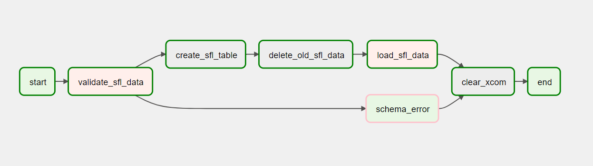
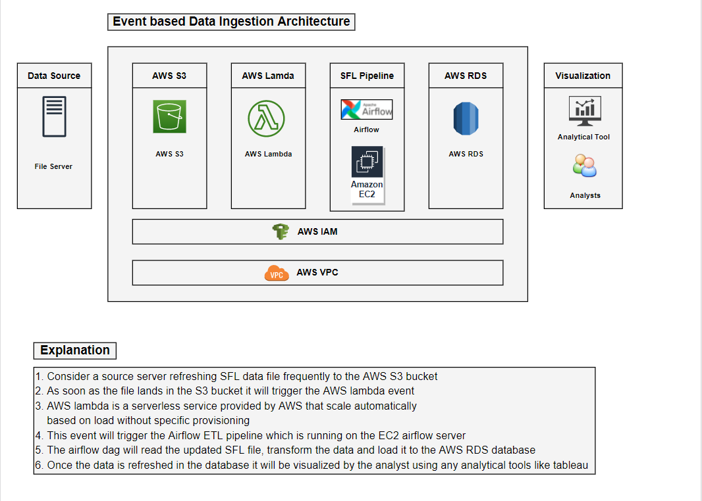
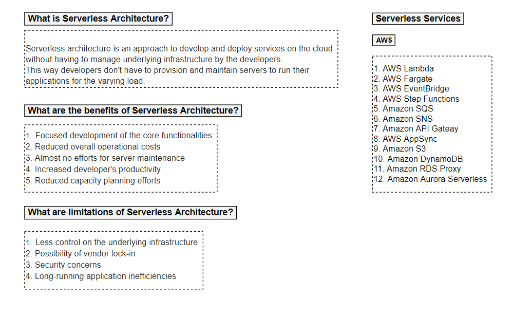
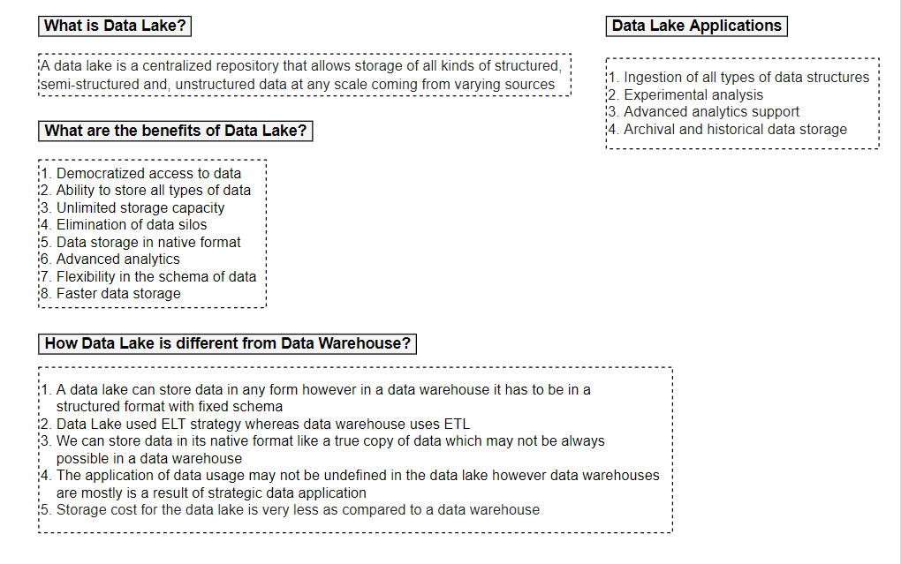
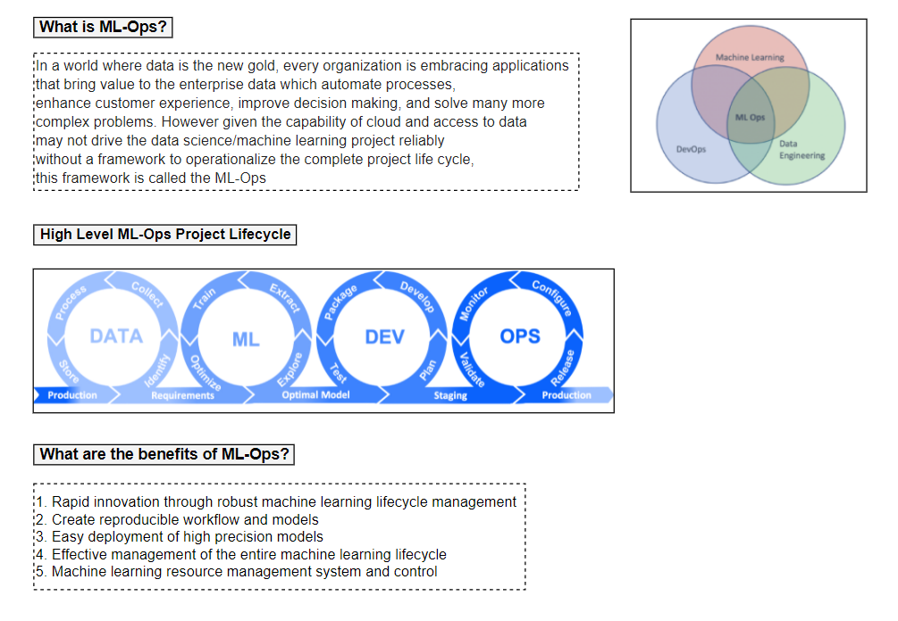

## SFL Data Challenge Airflow Pipeline:

Author: Pramod Nagare

Email: pramodnagare1993@gmail.com 

Phone: +1 857-269-6180

======================================================

### Overall Pipeline:

### A. Read Problem Statement:
Refer the problem statement from <i>challenge</i> folder

### B. Explore the data:
Data is available in <i>/dags/data</i> folder

Column List: ["id", "first_name", "last_name", "email", "gender", "ip_address"]

Record Example: 1,Margaretta,Laughtisse,mlaughtisse0@mediafire.com,Genderfluid,34.148.232.131

### C. Data Transformation:

Fill null values with default values for the columns:

'first_name': 'FNU',
'last_name': 'LNU',
'email': '',
'gender': '',
'ip_address': ''

Create a derived columns domain by splitting the email on '@'
Also while adding the records to Postgres table add load_date column

 ### D. Airflow and Postgres Setup:
 1. Refer docker-compose.yml file for the implementation
 2. We have 3 containers running:
    * Postgres Database
    * Airflow Scheduler
    * Airflow Webserver
 3. Make sure to install docker and docker-compose on the local machine
    - Install [Docker](https://www.docker.com/)
    - Install [Docker Compose](https://docs.docker.com/compose/install/)
 
 4. Run <i>docker-compose up -d </i> 
 5. Once all containers are up and running; login to Airflow: http://localhost:8080/admin  
    username: admin
    password: admin
 6. update the below configuration on airflow portal (http://localhost:8080/connection/list/)
 7. Update the postgres_default connection in Airflow UI with following details:
    * Host : postgres
    * Schema : airflow
    * Login : airflow
    * Password : airflow
 8. Update the airflow_db connection in Airflow UI with following details:
    * Host : postgres
    * Schema : airflow
    * Login : airflow
    * Password : airflow
 9. Create a variable for SFL Data pipeline:
    Variable name: sfl_var
    Value: {"internal_email": "<your-email-id>"}
 10. Install PGAdmin on local machine to connect to Postgres database and table
 11. Create a server connection with below details:
    host: localhost
    port: 5432
    database: airflow
    username: airflow
    password: airflow
 12. Enable and run the dag
 13. View the data updates in pgadmin querying sfl_data table

### E. Documentation:

